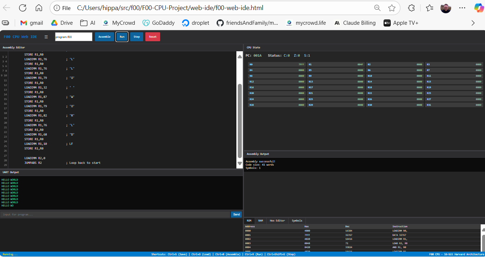

# F00 CPU Project

A complete development environment and implementation for the F00 16-bit embedded CPU, originally designed by Jeff Davies in 1999.
[try IDE](https://raw.githack.com/hipparchus2000/f00/master/F00-CPU-Project/web-ide/f00-web-ide.html)

## 🚀 Quick Start

### Web IDE (Recommended)
1. **Open** `web-ide/f00-web-ide.html` in any modern web browser
2. **Load an example** by clicking the "Example" button
3. **Assemble** the code with Ctrl+B or the "Assemble" button
4. **Run** the program with Ctrl+R or the "Run" button
5. **Watch output** in the UART terminal window

### Example Programs
Try these sample programs in the `examples/` folder:
- `hello-world.f00` - Basic UART output
- `arithmetic-test.f00` - Tests all arithmetic operations
- `memory-test.f00` - Memory read/write verification
- `fibonacci.f00` - Fibonacci sequence generator

## 📁 Project Structure

```
F00-CPU-Project/
├── README.md                  # This file
├── licence.htm               # Original GPL license
├── web-ide/                  # Complete web-based development environment
│   ├── f00-web-ide.html     # Single-file IDE (assembler + simulator)
│   └── README.md            # Web IDE documentation
├── examples/                 # Sample F00 assembly programs
│   ├── arithmetic-test.f00  # Arithmetic operations test
│   ├── fibonacci.f00        # Fibonacci sequence
│   └── memory-test.f00      # Memory operations test
├── documentation/            # Technical documentation
│   ├── F00-CPU-Programmers-Reference.md  # Complete ISA reference
│   └── ...                  # Additional docs
├── tools/                    # Development tools (future)
└── archive/                  # Historical/reference files
    ├── original-abel/        # Original Abel HDL source
    ├── original-c-tools/     # Original C assembler/simulator
    ├── vhdl-translation/     # Abel-to-VHDL translation
    ├── original-documentation/  # Original design docs
    └── original-archive/     # Jeff Davies' original files
```

## 🎯 F00 CPU Overview

The F00 is a **16-bit Harvard architecture** embedded CPU designed for:
- **FPGA implementation** (13,000 gates target)
- **Real-time applications** (no virtual memory overhead)
- **Educational use** (clean, simple instruction set)
- **Embedded systems** (multimedia, consumer electronics)

### Key Features
- **32 general-purpose registers** (R0-R31)
- **64KB instruction space** + **64KB data space**
- **Memory-mapped I/O** with virtual UART
- **Supervisor/user modes** with MMU support
- **Interrupt handling** and system calls
- **RISC-like instruction set** with 16-bit fixed-width instructions

## 🔧 Development Workflow

### 1. Write Assembly Code
```assembly
; Hello World in F00 Assembly
CODEORG 0

START:  LOADIMM R0,32767    ; UART address
        LOADIMM R1,72       ; 'H'
        STORE R1,R0         ; Print character
        ; ... continue with more characters
        JUMPRIMM START      ; Loop
```

### 2. Use the Web IDE
- **Syntax highlighting** with line numbers
- **Real-time assembly** with error reporting
- **Step-by-step debugging** with register monitoring
- **Memory visualization** (ROM, RAM, hex dump)
- **UART I/O terminal** for program interaction

### 3. Test and Debug
- **Single-step execution** to trace program flow
- **Register monitoring** with change highlighting
- **Memory inspection** in multiple formats
- **Symbol table** for label/address lookup

## 📚 Documentation

### For Programmers
- **[F00 CPU Programmer's Reference](F00-CPU-Project/documentation/F00-CPU-Programmers-Reference.md)** - Complete instruction set and architecture guide
- **[Web IDE User Guide](F00-CPU-Project/web-ide/README.md)** - How to use the development environment

### For Hardware Engineers  
- **[VHDL Implementation](F00-CPU-Project/archive/vhdl-translation/)** - Synthesizable VHDL translation

## 🎮 Instruction Set Highlights

### Data Movement
- `MOVE Ra,Rb` - Copy register to register
- `LOAD Ra,Rb` - Load from memory address in Ra
- `STORE Ra,Rb` - Store to memory address in Rb
- `LOADIMM Ra,#imm` - Load 16-bit immediate value

### Arithmetic & Logic
- `ADD Ra,Rb` - Add with carry/zero flags
- `SUB Ra,Rb` - Subtract with flags
- `AND/OR/NOT Ra,Rb` - Bitwise operations
- `SHIFTL/SHIFTR Ra,Rb` - Single-bit shifts

### Control Flow
- `JUMPABS Ra` - Jump to address in register
- `JUMPRIMM #offset` - Relative jump (-512 to +511)
- `JUMPRIMMC/JUMPRIMMZ` - Conditional jumps (carry/zero)
- `SYSCALL` - System call (supervisor mode)

## 💻 System Requirements

### Web IDE
- **Any modern browser** (Chrome, Firefox, Safari, Edge)
- **No installation required** - runs entirely in browser
- **Offline capable** - no internet connection needed
- **Works on tablets** - responsive design

### Historical Tools (Archive)
- **Xilinx Foundation** (for original Abel/VHDL)
- **GCC** (for original C assembler/simulator)
- **Linux/Windows** (original development environment)

## 🤝 Contributing

This is an educational and historical preservation project. Contributions welcome:

1. **Bug reports** for the web IDE or simulator
2. **Example programs** demonstrating F00 capabilities  
3. **Documentation improvements** and tutorials
4. **Tool enhancements** (debugger features, optimizations)

## 📜 License & Credits

### Original F00 Design
- **Designer**: Jeff Davies (1999)
- **License**: GNU Public License (see `licence.htm`)
- **Website**: Originally hosted at jeff@llandre.freeserve.co.uk

### Modern Implementation  
- **Web IDE**: JavaScript translation of original C tools
- **VHDL Translation**: Modernized HDL implementation
- **Documentation**: Comprehensive programmer's reference
- **Examples**: Educational assembly programs

## 🌟 Legacy

The F00 CPU represents an important milestone in open-source processor design, predating many modern RISC-V and open hardware initiatives. This project preserves Jeff Davies' pioneering work while making it accessible to modern developers and students.

**Ready to start programming?** Open `web-ide/f00-web-ide.html` and begin your F00 CPU journey!

---

*"The F00 CPU - Where embedded processing meets educational excellence"*
